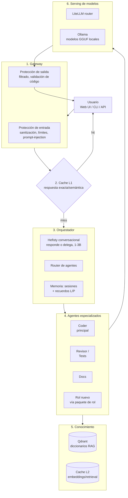

# Arquitectura

Hefisty se organiza en capas: gateway con protecciones → cache → orquestador → agentes especializados → conocimiento y serving de modelos locales. Tres principios de diseño: (1) un **router multi-modelo** con agentes especializados detrás en lugar de un único modelo, (2) protecciones de entrada/salida centralizadas en el gateway, (3) cache en dos niveles con propósito claro.

## Diagrama

## Componentes

### 0. Front (web propia)
Interfaz principal: SPA de chat (React + Vite en `web/`) compilada a estáticos y servida por el propio gateway en `http://localhost` — sin servidor extra ni dependencia de nube. Características: streaming de respuestas (SSE), lista de sesiones (crear/retomar/renombrar), indicador de qué agente está trabajando y qué modelo está cargado, y vista de roles instalados. La CLI (`hefisty ask`) se mantiene para uso rápido y scripting. El gateway expone además API OpenAI-compatible, así que cualquier cliente estándar puede conectarse como alternativa.

### 1. Gateway (FastAPI)
Único punto de entrada. Autenticación por token local, rate limiting, y las dos protecciones unificadas aquí: sanitización de entrada (detección de prompt injection con reglas + modelo pequeño) y validación de salida (no filtrar secretos, código sintácticamente válido cuando aplique).

### 2. Cache L1 — respuestas
Redis. Dos modos: hash exacto de la petición normalizada, y cache semántica (embedding de la query, umbral de similitud ~0.95). TTL corto para código (el contexto del repo cambia), largo para consultas de conocimiento.

### 3. Orquestador (la pieza propia clave)
- **Hefisty (modelo frontal conversacional):** un modelo de 1–3B (ej. Qwen3 1.7B) siempre cargado, con doble función. Primero **conversa**: charla directa, preguntas aclaratorias cuando la petición es ambigua ("¿en qué proyecto?", "¿qué lenguaje?"), estado del sistema y de las sesiones. Segundo **clasifica y delega**: cuando detecta una tarea de trabajo concreta, elige el agente y la deriva automáticamente. La decisión conversar-vs-delegar la toma ella misma en cada turno — el usuario no elige herramienta, solo habla. Barato y rápido: este es el mecanismo que "economiza recursos" (el modelo grande solo se carga cuando hay trabajo real).
- **Router:** carga/descarga modelos bajo demanda vía Ollama (`keep_alive`). Con 16 GB de VRAM solo el modelo del agente activo + el clasificador residen en memoria a la vez.
- **Gestor de sesiones:** cada conversación es una sesión con ID, persistida en SQLite (historial comprimido, estado de la tarea, archivos tocados, agente activo). Redis solo cachea la sesión activa. Esto permite: listar sesiones (`hefisty sessions`), retomar cualquiera donde quedó, y que Hefisty responda "¿en qué íbamos?" con el estado real — qué se hizo, qué falta y dónde está trabajando.
- **Descomposición:** tareas grandes se dividen en subtareas encadenadas entre agentes (coder → revisor → docs). El estado de la cadena vive en la sesión: si el proceso se interrumpe, se retoma desde la última subtarea completada.

### 4. Agentes
Un agente = **paquete de rol** declarativo (ver [ROLES.md](ROLES.md)): manifiesto YAML con modelo asignado, prompt de sistema, colección RAG, herramientas permitidas y LoRA opcional. Agregar un rol nuevo no toca el código del orquestador.

#### Coder jerárquico: especialistas por lenguaje

Un solo agente de código para todo se satura: contexto mezclado, convenciones cruzadas entre lenguajes. La solución NO es un modelo completo por lenguaje (con 16 GB de VRAM el intercambio constante de modelos de 9 GB destruiría la latencia), sino un **Coder principal + sub-roles por lenguaje sobre el mismo modelo base**:

- El Coder principal (gpt-oss:20b, MoE ~3.6B activos) planifica, descompone y delega. Elegido por su robustez en function-calling nativo (100% de tool_calls nativas en el bucle agéntico) y su velocidad (~60 tok/s en 16 GB), donde modelos densos como Qwen2.5-Coder 14B fallaban (0% nativas, dependían del parser de rescate).
- Cada lenguaje (Python, JS/TS, C#, etc.) es un sub-rol: **adaptador LoRA opcional + diccionario RAG propio** (docs del lenguaje, convenciones, snippets) + prompt especializado. Los adaptadores pesan MBs y se aplican sin recargar el modelo — especialización real con costo de intercambio casi nulo.
- El Coder principal detecta el lenguaje (por extensión de archivo o contenido) y activa el sub-rol antes de trabajar.

#### Navegación de código (cómo el Coder encuentra y modifica archivos)

Para trabajar sobre repos grandes el Coder no carga todo el proyecto en contexto; usa **herramientas agénticas** en bucle (buscar → leer → decidir → editar), igual que los asistentes de código actuales:

- **Búsqueda estructural:** glob (patrones de archivos) y grep (contenido) para reducir candidatos.
- **Índice semántico del repo:** cada repo del usuario se embebe en Qdrant (por símbolo/función, actualización incremental en cada commit). Permite resolver pistas vagas: "el componente del header con los colores azules" → búsqueda semántica → 3 archivos candidatos → grep confirma.
- **Lectura por fragmentos:** el Coder lee solo las secciones relevantes (rangos de líneas), no archivos completos — preserva contexto.
- **Edición por diff:** modificaciones como reemplazos exactos verificables, nunca reescritura completa del archivo. Cada edición se registra en la sesión.
- **Pistas visuales (fase posterior):** un modelo de visión pequeño (ej. Qwen2.5-VL 7B) traduce capturas de pantalla del usuario a descripción textual ("botón azul en la esquina del header"), que alimenta la búsqueda semántica. Así se cubre el flujo "te mando una foto, encuentra el componente y cámbialo".

### 5. Conocimiento (los "diccionarios")
Qdrant con una colección por rol. El "diccionario de cómo programar" es la colección del Coder: documentación de lenguajes, convenciones del usuario, snippets del propio repo indexados. Cache L2 guarda resultados de retrieval frecuentes.

### 6. Serving de modelos
- **Ollama** como runtime único en fase 1 (multiplataforma, gestión de modelos integrada, usa llama.cpp por debajo).
- **LiteLLM** delante: los agentes hablan un solo protocolo OpenAI-compatible; cambiar un modelo es editar config, no código. Permite failover y, a futuro, mezclar backends (vLLM en tier ultimate).

### Asignación de modelos inicial (16 GB VRAM)

| Función | Modelo | VRAM aprox (Q4) |
|---|---|---|
| Clasificador/router | Qwen3 1.7B | ~1.5 GB |
| Coder (principal) | gpt-oss:20b (MoE, ~3.6B activos) | ~13 GB |
| Revisor/Docs | mismo modelo con prompt distinto (0 extra) | 0 |
| Embeddings | nomic-embed-text | ~0.5 GB |
| Roles nuevos | 7B genérico (Qwen3 8B) + RAG del rol | ~5 GB |
| Sub-roles de lenguaje | LoRA sobre el Coder base | ~0 (MBs) |
| Visión (fase posterior) | Qwen2.5-VL 7B, carga bajo demanda | ~5 GB |

Regla: clasificador + embeddings siempre residentes; el resto se intercambia. Nunca más de un modelo grande cargado.

### 7. Aprendizaje por feedback (recompensa/castigo)

El ciclo que permite que Hefisty y sus agentes mejoren con el uso. Tres capas:

- **Captura.** Explícita: botones 👍/👎 en cada respuesta del front (con comentario opcional) y comando `hefisty feedback`. Implícita: señales detectadas por el frontal — el usuario pide rehacer algo ("no me gustó", "está mal") = castigo; acepta y continúa sobre el resultado = recompensa débil. Cada señal se guarda ligada a su contexto completo: sesión, turno, agente, rol, modelo, prompt usado y chunks RAG recuperados.
- **Reacción inmediata.** Un 👎 invalida la entrada de cache de esa respuesta y ofrece reintento con ajuste; los chunks RAG que participaron en respuestas castigadas pierden peso en el ranking de retrieval (y lo ganan con 👍) — el "diccionario" aprende qué páginas suyas sirven.
- **Aprendizaje diferido (fase 5).** El feedback acumulado se convierte en datasets por rol: pares con 👍 → ejemplos positivos para LoRA; pares 👎+corrección → pares de preferencia (respuesta mala vs corregida) para DPO local. Con suficiente volumen, cada rol se reentrena periódicamente con lo que a SU usuario le gusta — personalización real sin datos externos.

Almacenamiento: tabla `feedback` en SQLite junto a las sesiones; exportable a JSONL formato `{"u", "a", "score"}` para entrenamiento.

### 8. Memoria de corto y largo plazo

Lo que hace que Hefisty "conozca" a su usuario más allá de la sesión actual:

- **Corto plazo (ya existe):** la sesión activa — historial comprimido, subtareas, archivos tocados. Vive en SQLite, cacheada en Redis.
- **Largo plazo (recuerdos):** hechos y preferencias persistentes entre sesiones — cómo se llama el usuario, en qué proyectos trabaja, su estilo de código preferido, manías y correcciones recurrentes.
  - **Escritura (consolidación):** al cerrar sesión (o cada N turnos), el modelo frontal repasa la conversación y extrae recuerdos nuevos o actualizados como hechos atómicos ("prefiere inyección por constructor", "su app principal es X en Kotlin"). Nada se memoriza en caliente sin pasar por este filtro — evita basura.
  - **Almacén:** tabla `memories` en SQLite (hecho, categoría, fecha, origen, fijado sí/no) + embedding en colección Qdrant `memoria` para búsqueda semántica.
  - **Lectura:** en cada turno, el frontal recupera los top-k recuerdos relevantes a lo que se habla y los incluye en su contexto — Hefisty se acuerda sin que se lo pidan.
  - **Transparencia y control:** `hefisty memory list / forget <id> / add "..."` y panel en el front. Los recuerdos son del usuario: visibles, editables, borrables.
  - **Olvido natural:** decaimiento por antigüedad y desuso (los recuerdos no usados pierden peso hasta archivarse), salvo los fijados. Una memoria que solo crece termina recordando ruido.
- **Privacidad:** todo en `data/` (gitignorado); los recuerdos jamás salen de la máquina ni entran a datasets de entrenamiento sin revisión explícita del usuario.

## Flujo de una petición

1. Entrada → gateway (protección) → ¿cache L1? → si hit, respuesta.
2. Hefisty evalúa: ¿conversación o trabajo? Si es charla o falta información, responde ella misma (o pregunta) sin cargar ningún modelo grande. Si es tarea clara → router elige agente → carga su modelo si no está.
3. Agente hace retrieval en su colección RAG → construye contexto → infiere.
4. Si la tarea lo requiere, encadena al siguiente agente (ej. revisor).
5. Salida → protección de salida → cache → usuario. Todo se registra (observabilidad: logs estructurados + métricas de latencia/VRAM).

## Decisiones y alternativas descartadas

- **Orquestador propio vs LangGraph/CrewAI:** capa propia sobre LiteLLM. Los frameworks aceleran pero agregan dependencia pesada; el patrón router+agentes es simple de implementar y este proyecto ES el orquestador. Se puede adoptar LangGraph después solo para flujos complejos.
- **vLLM en fase 1:** descartado; brilla con concurrencia multi-usuario y pide más setup. Ollama gana en simplicidad para un usuario. Queda como upgrade del tier ultimate.
- **Un modelo grande vs varios pequeños:** varios pequeños especializados + RAG rinden mejor por GB y permiten el intercambio dinámico en 16 GB.
